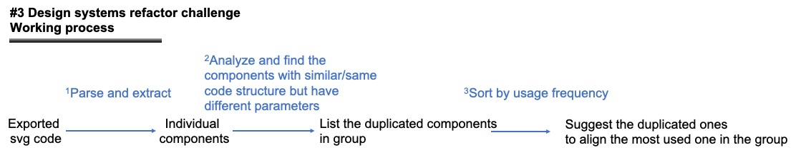

# Approach #2 | Refactoring duplicated components
    
The system will help users to avoid maintenance overload. The idea is to group the duplicated components with similar appearance but the same purpose and suggest designers merge the similar ones.

| Technology readiness | Risks | Complexity |
| ----- | ----- | ---------- |
| <div style="width: 200pt"> 🟡 Some elements are available, but further development and research needed | <div style="width: 150pt"> 🟡 Moderate risk | <div style="width: 130pt"> 🟠 Moderately complex |


## Technology pipeline



<details>
<summary>Step #1) Parse and extract individual components via component-id:</summary>

- components.svg: parse by `symbol`
</details>

<details>
<summary>Step #2) Analyse and find the components with similar code structures but have different parameters:</summary>

- Detect the duplicated components via code structure to mimic the often happened situations in real-world
- First, simplifying codes via SVG Optimizer [[Github](https://github.com/svg/svgo)], achieving 17% compression (#7783 → #1328 lines), by removing redundant and useless information without affecting the SVG rendering result
    <details>
    <summary>There are 2 examples</summary>

    - Example #1 | user profile: displaying user profiles but have different widths, fill_color, text positions, etc.
    
        Card A

        ```css
            <g class="profile-card">
                <rect x="0" y="0" width="300" height="200" fill="#F1F1F1" />
                <text x="20" y="40" fill="#000000">John Doe</text>
                <circle cx="150" cy="100" r="50" fill="#A0A0A0" />
                <text x="150" y="150" fill="#000000" text-anchor="middle">Software Engineer</text>
            </g>
        ```

        Card B
            
        ```css
            <g class="profile-card">
                <rect x="0" y="0" width="320" height="220" fill="#EFEFEF" />
                <text x="30" y="50" fill="#000000">Jane Smith</text>
                <circle cx="160" cy="110" r="45" fill="#B0B0B0" />
                <text x="160" y="160" fill="#000000" text-anchor="middle">Product Designer</text>
            </g>
        ```
    - Example II - button: the same purpose of being clickable elements but have different widths, text content, and position:
            
        Button A

        ```css
            <rect x="0" y="0" width="100" height="40" fill="#FF0000" />
            <text x="50" y="20" fill="#FFFFFF" text-anchor="middle">Click Me</text>
        ```

        Button B
            
        ```css
            <rect x="0" y="0" width="120" height="40" fill="#FF0000" />
            <text x="60" y="20" fill="#FFFFFF" text-anchor="middle">Press Here</text>
        ```
    </details>
    
    Besides code structure, we could also consider “atomic” conventions to find similar ones, e.g.,

    <details>
    <summary>organism/molecule/atom/variation</summary>

    - An example with the above elements might be
        - Eg icon: icon/gear
        - Eg button: button/primary/icon/hover
    </details>

    **Method: AI vs. traditional methods**
    
    - AI: 👎 need large labeled data 👍 can tackle more complex code
    
    - Traditional methods: 👎 can only tackle code in simple structure 👍 more efficient

</details>

<details>
<summary>Step #3) Sort by usage frequency and suggest the duplicated ones align with the most used one in the group</summary>  

- Invite human in the loop to decide whether to merge or not

</details>


## Requirements

- a python script for:
    1. extract individual components from components.svg
    2. use SVG Optimizer [[Github](https://github.com/svg/svgo)] to optimize extracted components
    3. use AI/traditional methods to detect similar components with similar code structure
    4. sort similar components in group to find the most usage form, then, suggest designers to align the outlier to the most usage form
- Input: components.svg, which is one of the exported file from penpot.app
- Output: detected components with similar structure
- Dataset: if we choose to use AI for detecting similar components, we need datasets with similar components inside for finetuning LLM model

## Relevant works

- Group components: MenuCraft [[Paper](references/research_papers/MenuCraft.pdf)]
- When comparing components, we could follow DeepSVG [[Paper](references/research_papers/DeepSVG.pdf)] and IconShop [[Paper](references/research_papers/IconShop.pdf)] to remove all the attributes and only compare the path

## Pros and Cons

🟢 Pros
    
- Have existing sub-solutions for building this solution
- Assist users in avoiding maintenance overload

🔴 Cons

- LLM would have limited input tokens that increase the risk of inputting large components.svg
- Might suggest unexpected components for grouping →  invite human in the loop to make the final decision
- The research scale for this solution lies in Design System v2.0 & Material Design 3, and we also consider the usage habits of designers from Penpot’s share. In the real-world design system, there might be more complex situations that can't be addressed.
